<!-- markdownlint-disable MD001 MD025 MD060 -->

# Praxis Grid Adaptive Cloud Bursting

<!-- markdownlint-disable MD034 -->
https://github.com/user-attachments/assets/6cb33a69-288d-4195-8f80-c6bc537f2d41
<!-- markdownlint-enable MD034 -->

This demo presents **Praxis Grid adaptive inference routing and cloud
bursting for Kubernetes**.

It demonstrates how Grid can continuously react to changing provider health,
locality, queue pressure, token consumption, and available overflow capacity
while keeping the Grid control plane **out of the synchronous inference request
path**.

```text
Grid observes and computes policy asynchronously
                    |
                    v
        versioned routing snapshot
                    |
                    v
              Praxis gateway
                    |
             local selection
                    |
                    v
             selected provider
```

Praxis does not call Grid, Kubernetes, Prometheus, llm-d/EPP, or another remote
scoring service for each request. It executes the latest accepted policy
snapshot locally.

---

## Architecture document

The broader policy architecture used by this demo is summarized in the
architecture and policy sections below. The full architecture document is
maintained with the implementation planning materials.

That document covers:

- admission and provider eligibility;
- same-site, same-zone, and same-region active provider grouping;
- weighted and pressure-aware placement;
- queue-depth and KV-cache pressure policies;
- local rebalancing before cloud overflow;
- independent burst and overflow-provider policies;
- token governance;
- multi-gateway and multi-provider scaling;
- provider security boundaries;
- observability and policy feedback loops; and
- the path toward future cost-aware placement.

---

# What the demo proves

The recording composes several Grid and Praxis capabilities into one end-to-end
scenario:

- **local-first inference routing** across Kubernetes-hosted providers;
- **active provider grouping** without falsifying site or region identity;
- **weighted request placement** inside an active provider group;
- **queue-aware provider pressure** using llm-d/EPP metrics;
- **reactive overflow routing** when preferred capacity becomes constrained;
- **independent admission, grouping, placement, burst, and overflow policies**;
- **soft token governance** backed by shared distributed token state;
- **token continuity across multiple Praxis gateways and provider changes**;
- **OpenTelemetry route and provider attribution**;
- **versioned routing state** so requests can be correlated with the policy
  snapshot that served them; and
- **recovery back toward preferred Kubernetes inference capacity** as pressure
  falls.

The overflow tier is provider-neutral. Depending on deployment policy, it may
contain providers such as:

- AWS Bedrock;
- Azure-hosted model services;
- Anthropic;
- OpenAI;
- Google Vertex AI / Gemini; and
- other compatible model-provider APIs.

The recording does not claim that every provider above is exercised in this
specific run. They represent the external-provider class supported by the
architecture.

---

# User story: keep Grid out of the request hot path

> **As a platform operator, I want Grid to make sophisticated multi-cluster
> routing decisions without making every inference request wait on the control
> plane.**

Grid is the asynchronous policy plane. Praxis is the fast local execution
plane.

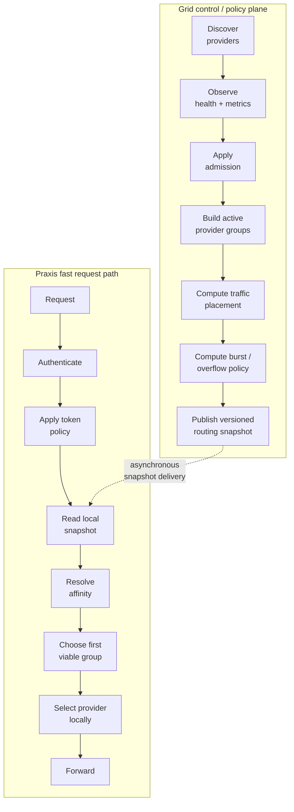

Grid may reconcile changing distributed state at its own cadence.

Praxis continues serving from the last accepted routing snapshot and atomically
moves to a newer snapshot after validation.

---

# User story: understand policy as independent decisions

> **As an operator, I want each routing policy to answer one clear question so
> I can change one behavior without accidentally changing several others.**

The demo treats routing as a composition of independent policies:

| Policy | Question |
|---|---|
| **Admission** | May this provider receive new or existing traffic? |
| **Grouping** | Which eligible providers actively compete together? |
| **Placement** | How is traffic divided inside the active group? |
| **Burst policy** | How much traffic should leave preferred capacity? |
| **Overflow policy** | Where should overflow traffic go? |
| **Affinity** | Should an existing session remain on its current provider? |
| **Token policy** | How is a user or workload's token consumption governed? |

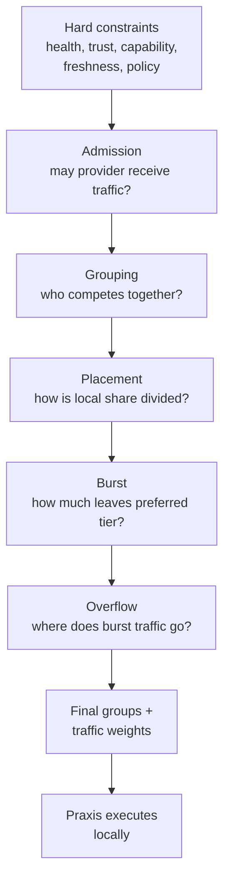

The key rule is:

> **Do not collapse locality, queue pressure, provider cost, and traffic
> percentage into one opaque score.**

---

# User story: keep provider topology truthful

> **As a regional platform owner, I want multiple providers in different sites
> to actively share traffic without pretending they are the same physical
> site.**

Grid keeps site and region identity intact.

For example, two providers can remain distinct:

```text
Qwen East
  site: east
  region: region-a

Qwen West
  site: west
  region: region-a
```

while still participating in the same active regional group.

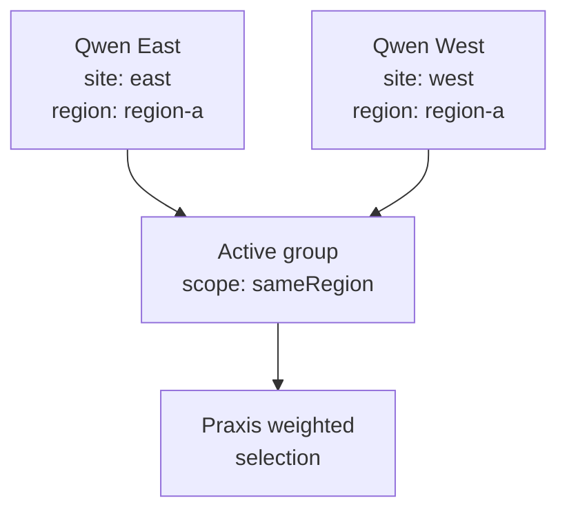

Grouping answers:

```text
Which providers may actively compete together?
```

Traffic weight answers:

```text
How much new traffic should each eligible member receive?
```

Those remain separate policies.

---

# User story: rebalance locally before paying for overflow

> **As a GPU fleet owner, I want Grid to use available Kubernetes-hosted
> inference capacity before introducing external-provider cost.**

One hot provider should not make the entire preferred tier look saturated.

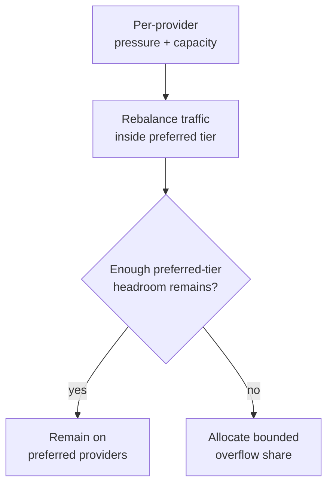

### Example

Suppose:

```text
East queue pressure: 0.95
West queue pressure: 0.35
```

The first response should be to reduce East's new-traffic share and move more
traffic toward West.

```text
Before pressure:

East    50%
West    50%
Cloud    0%

East becomes hot:

East    15%
West    85%
Cloud    0%
```

Only when the preferred tier as a whole loses enough usable headroom should
Grid begin allocating traffic to overflow providers.

---

# User story: use soft burst before hard fallback

> **As an application owner, I want the platform to add external capacity
> gradually instead of waiting for local inference to fail completely.**

The target behavior has three stages:

1. **Local rebalance** — move traffic among healthy preferred providers.
2. **Soft burst** — move only the necessary share to overflow capacity.
3. **Hard fallback** — if preferred providers cannot accept new work, overflow
   handles eligible new traffic.

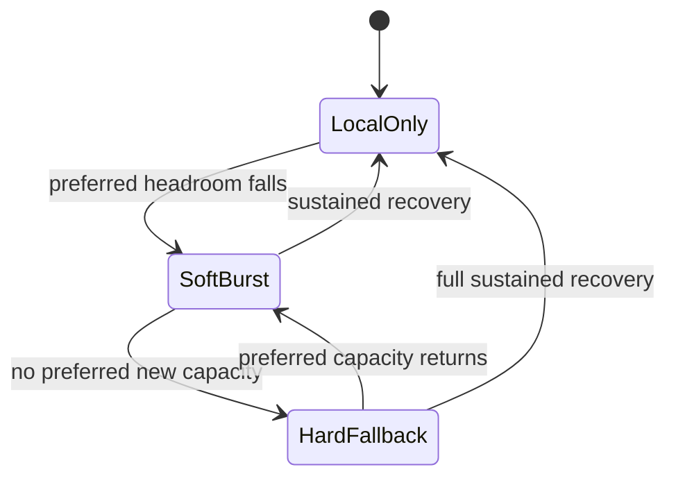

### Example progression

| State | Preferred providers | Overflow |
|---|---:|---:|
| Healthy | 100% | 0% |
| Moderate sustained pressure | 90% | 10% |
| Higher pressure | 70% | 30% |
| No preferred new capacity | 0% new traffic | 100% new traffic |
| Recovery | ramps upward | ramps downward |

The exact percentages are policy results, not hard-coded product constants.

---

# User story: pressure changes placement without overriding admission

> **As an inference operator, I want queue or KV-cache pressure to shift
> traffic gradually while admission remains the hard safety boundary.**

Admission answers:

```text
Can this provider receive traffic?
```

Placement answers:

```text
How much new traffic should this eligible provider receive?
```

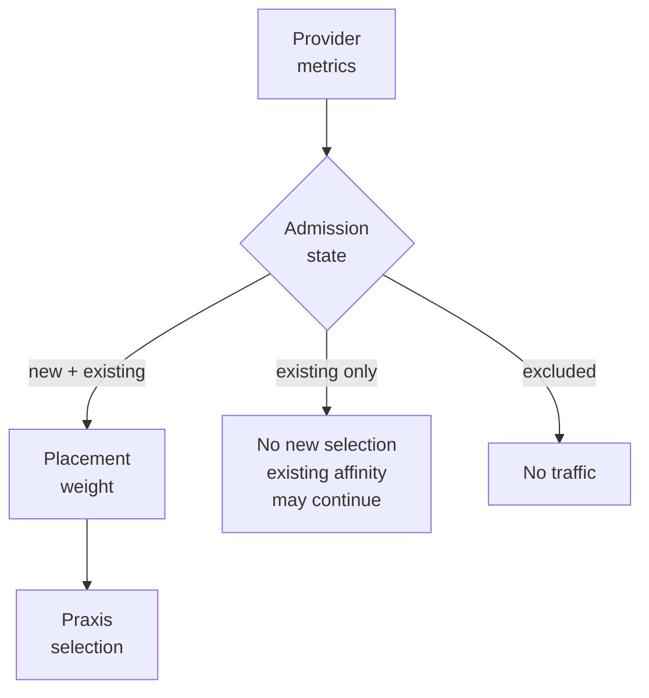

Example:

```text
Provider A
  admission: new_and_existing
  traffic weight: 20

Provider B
  admission: new_and_existing
  traffic weight: 80
```

Both remain eligible, but B receives a larger share of new unbound traffic.

If A moves to `existing_only`, its prior weight no longer allows it to receive
new selections.

---

# User story: avoid routing flaps

> **As an operator, I want routing to react to sustained pressure without
> generating a new policy snapshot for every small metric movement.**

Pressure-aware placement should be damped.

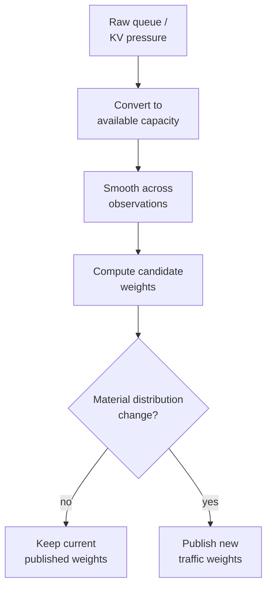

Useful anti-flap controls include:

- smoothing across observations;
- separate pressure and recovery behavior;
- bounded minimum and maximum weights;
- material-change thresholds;
- admission hysteresis;
- minimum dwell time; and
- recovery hold-down.

Small oscillations should not automatically generate continuous routing churn.

---

# User story: make burst amount independent from burst destination

> **As a cloud economics owner, I want to decide how much traffic needs
> external capacity separately from which external provider receives it.**

There are two independent decisions:

```text
HOW MUCH traffic should overflow?
```

and:

```text
WHERE should that overflow traffic go?
```

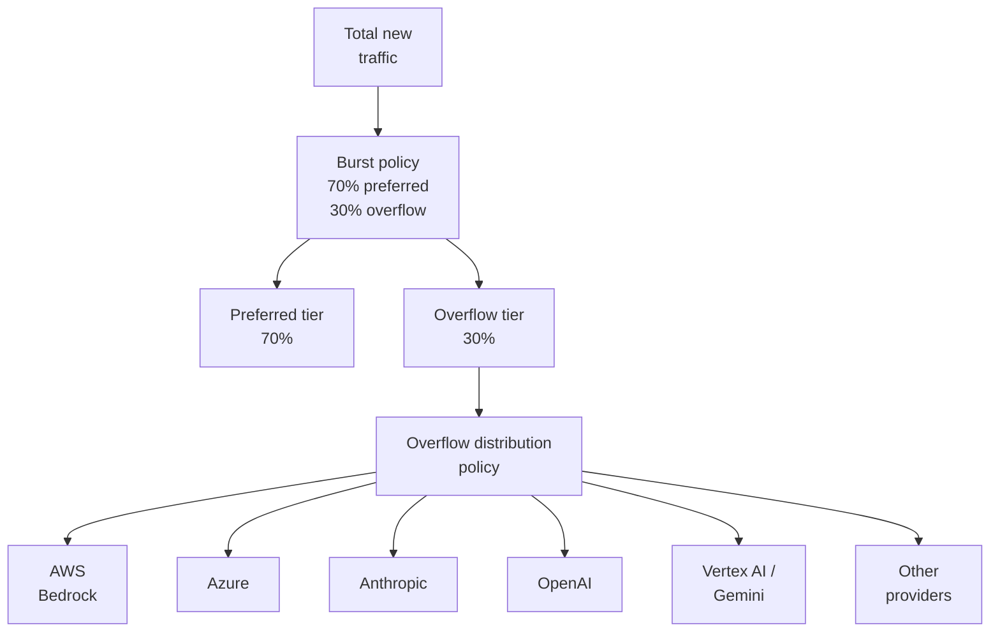

### Example

Grid decides:

```text
overflow share = 30%
```

The overflow policy independently decides:

```text
Bedrock    50%
Azure      25%
Anthropic  15%
OpenAI     10%
```

The approximate total distribution becomes:

```text
Preferred providers   70.0%
Bedrock                15.0%
Azure                   7.5%
Anthropic               4.5%
OpenAI                  3.0%
```

Changing the cloud-provider ratio should not change the burst percentage.
Changing the burst percentage should not change the relative overflow-provider
ratio.

---

# User story: use different signals for different policy decisions

> **As a policy author, I want queue depth, KV-cache pressure, locality, and
> future cost signals to affect only the decisions they are configured to
> influence.**

One deployment might eventually use:

```text
Burst policy
  input: aggregate preferred-tier queue / headroom
  result: 20% overflow

Preferred-tier placement
  input: KV-cache pressure
  result: East 70% / West 30% of retained local share

Overflow placement
  input: future cost policy
  result: Provider A 75% / Provider B 25% of overflow share
```

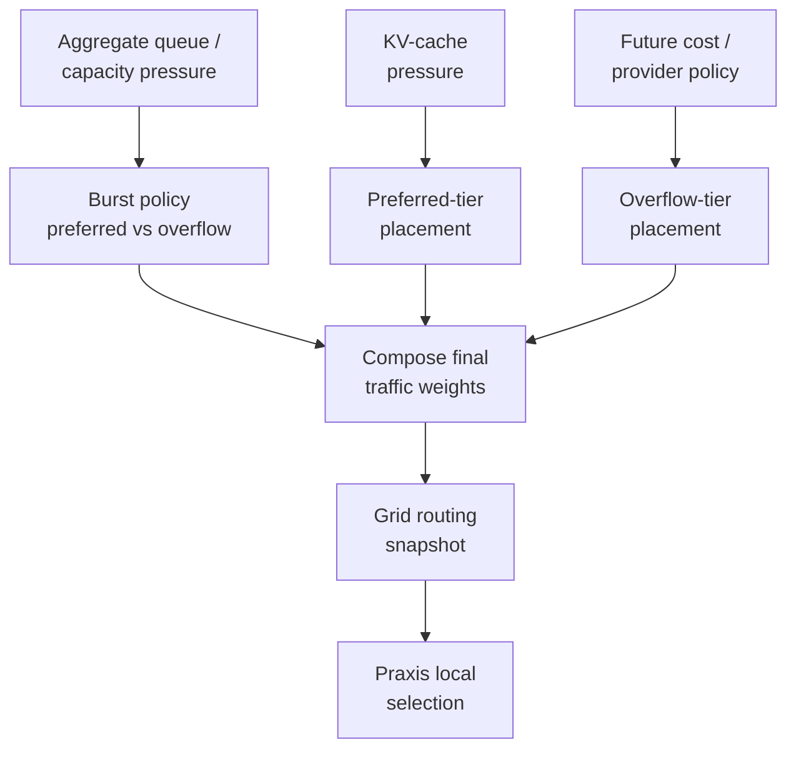

Praxis does not need to understand which signals produced the final weights.

---

# User story: scale to dozens of provider pools

> **As a fleet operator, I want the policy model to work for dozens of
> Kubernetes inference pools without pairwise comparisons or a centralized
> request coordinator.**

The scalable question is not whether any provider is overloaded. It is:

> **After redistributing traffic across admitted preferred providers, how much
> usable preferred-tier headroom remains?**

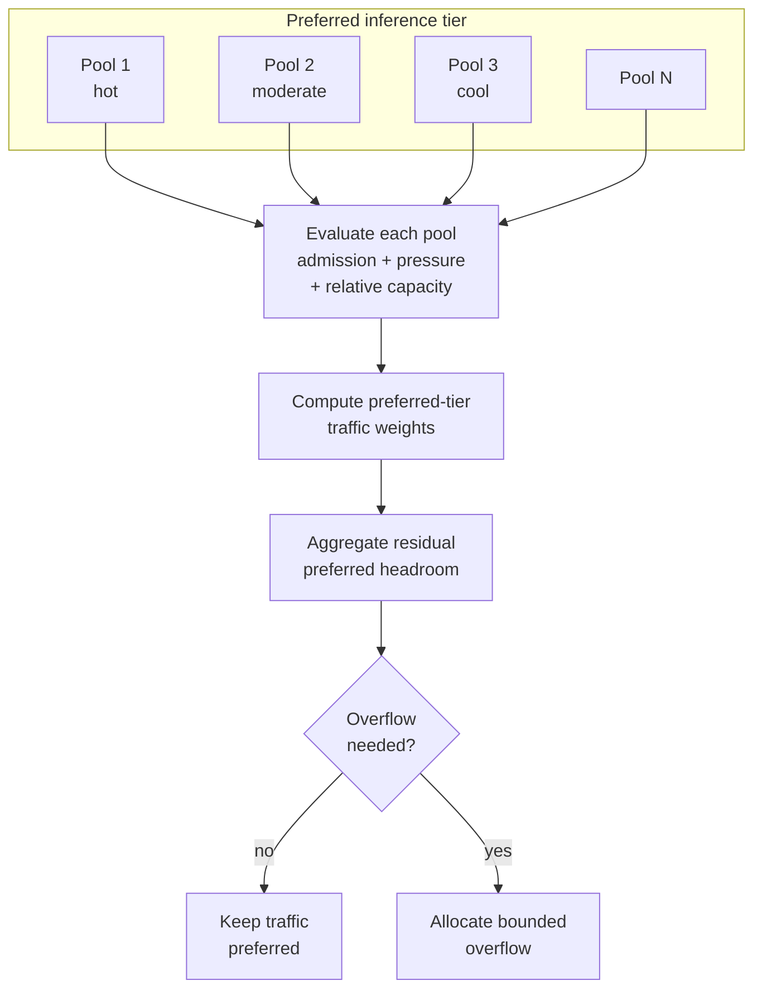

Each provider can be evaluated once, making the control-plane calculation
conceptually linear in the number of provider pools.

One hot provider does not automatically create cloud spend if the rest of the
preferred fleet has enough headroom.

---

# User story: scale to many Praxis gateways

> **As a networking operator, I want many Praxis gateways to execute the same
> routing policy without coordinating every weighted selection.**

Grid publishes routing state by routing perspective.

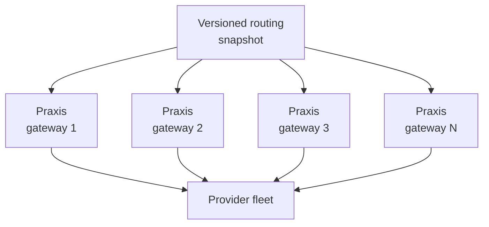

Round-robin counters and weighted draws are local. There is no distributed lock
for each provider selection.

Over sufficient request volume, aggregate traffic approaches the policy
published by Grid.

The shared state that does require coordination is token usage, which is
separate from routing selection state.

---

# User story: keep soft token governance independent from routing

> **As a platform owner, I want a user's token usage to remain continuous even
> while traffic moves between gateways, sites, clusters, and providers.**

The demo uses shared token state separately from routing.

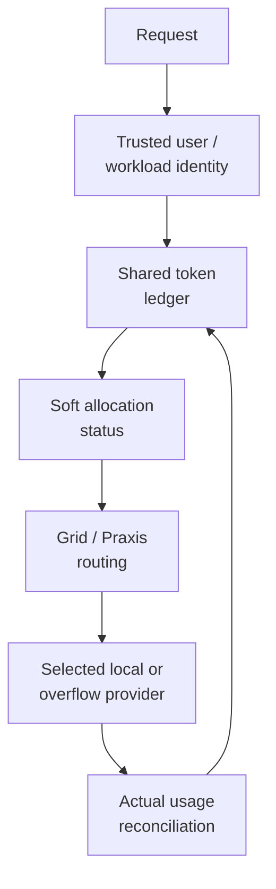

A soft token allocation can report:

```text
within allocation
approaching allocation
over allocation
```

without necessarily denying the request.

### Example

```text
Alice allocation: 10,000 tokens

Usage:  8,500
Status: within allocation

Usage: 10,500
Status: over allocation
Action: report / observe
Request: may continue under soft policy
```

A separate policy can choose hard enforcement where required.

Routing changes do not reset the token ledger. Token-policy changes do not reset
routing state.

---

# User story: preserve security at the provider boundary

> **As a security engineer, I want external-provider credentials to stay at the
> final provider hop and never become part of Grid traffic-selection metadata.**

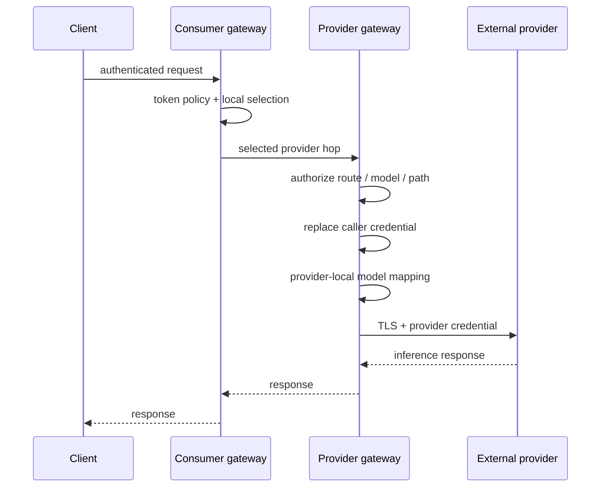

Grid selects a provider candidate. The provider gateway owns the final serving
and credential boundary.

That keeps the routing architecture generic across model-provider APIs with
different authentication mechanisms.

---

# User story: make policy changes observable

> **As an operator, I want to know why traffic moved and which routing snapshot
> made the decision.**

The demo records route/provider attribution through OpenTelemetry and associates
requests with the serving routing revision.

Useful evidence includes:

```text
request ID
gateway
logical model/service
serving routing revision
selection group
selection mode
selected provider
provider site / region
admission state
traffic weight
queue / pressure evidence
token allocation state
```

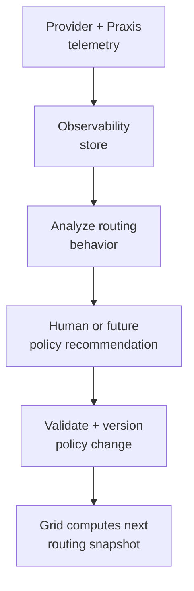

This creates a path toward future closed-loop optimization without putting an
AI model or dashboard into the synchronous request path.

---

# Presentation flow

The narrated recording follows this sequence:

1. **Architecture** — Grid computes policy asynchronously; Praxis executes it
   locally.
2. **Reactive burst** — use preferred capacity first, then introduce bounded
   overflow.
3. **Independent policies** — admission, grouping, placement, burst, and
   overflow remain separate.
4. **Soft token limits** — distributed token usage remains continuous and
   over-allocation can be reported without forced denial.
5. **Live demo** — baseline traffic, pressure, route movement, overflow, and
   recovery.
6. **Outro** — Grid remains off the request hot path.

---

# Live demo narrative

A representative run is:

```text
1. BASELINE

   preferred Kubernetes providers are healthy
   token usage is visible
   Grid publishes the baseline routing snapshot
   Praxis routes locally

2. PRESSURE

   provider queue pressure rises
   llm-d / EPP exposes the signal
   Grid observes the pressure

3. LOCAL REBALANCE

   Grid changes provider placement
   less new traffic goes to the pressured pool
   more goes to preferred providers with headroom

4. OVERFLOW

   preferred-tier headroom becomes insufficient
   Grid publishes a new policy revision
   some eligible new traffic moves to overflow capacity

5. TOKEN CONTINUITY

   the same user/workload token state is preserved
   routing changes do not create a new token allowance

6. RECOVERY

   local pressure falls
   Grid reduces the overflow share
   preferred capacity resumes more traffic

7. STEADY STATE

   Grid remains asynchronous
   Praxis continues selecting locally
```

---

# Generation assets

The slides, narration, recording, TTS helper, assembly scripts, and Playwright
review are maintained in the Traffic Theater implementation:

[Traffic Theater demo implementation](https://github.com/nerdalert/traffic-theater/tree/feat/reusable-recording-toolkit/examples/grid-cloud-burst)

That directory contains the reproducible production manifest and generated-video
workflow.

This Experimental directory contains the narrated-demo link, this README, and
the accompanying policy architecture document.

---

# Build inputs

The burst-routing work used for the current demo is composed from the following
development branches/checkpoints:

- **Praxis** —
  [`nerdalert/praxis`](https://github.com/nerdalert/praxis/tree/burst-routing-v1),
  branch `burst-routing-v1`, composed checkpoint `cf2a7bb6`.
- **Praxis AI** —
  [`nerdalert/ai`](https://github.com/nerdalert/ai/tree/burst-routing-v1),
  branch `burst-routing-v1`, checkpoint `557cd37`.
- **Grid** —
  [`nerdalert/grid`](https://github.com/nerdalert/grid/tree/burst-routing-v1),
  branch `burst-routing-v1`, checkpoint `8c8635c`.
- **Tracing UI** —
  [`nerdalert/praxis-tracing`](https://github.com/nerdalert/praxis-tracing/tree/burst-routing-v1),
  branch `burst-routing-v1`.

These are development checkpoints used for the composed demo. They should not
be interpreted as statements that every behavior described in the broader
architecture document has already merged upstream.

---

# Architectural summary

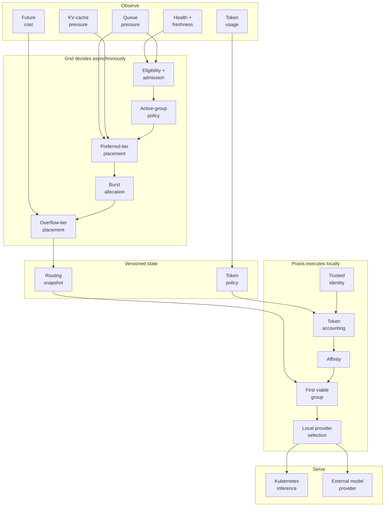

The through-line is:

> **Grid observes and composes policy. Grid publishes versioned execution state.
> Praxis executes that state locally. Telemetry feeds the next policy decision
> instead of becoming a synchronous dependency of the current request.**

<!-- markdownlint-enable MD001 MD025 MD060 -->
