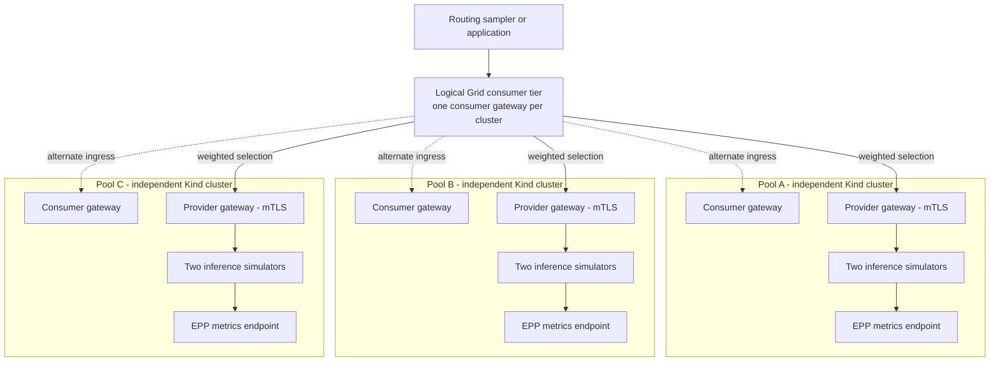
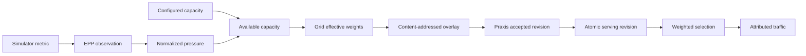

# Grid static and dynamic weighted routing

This demo shows how Grid distributes new inference requests across three
provider pools. Static weights describe relative capacity. Dynamic placement
adjusts those weights when an EPP reports queue or KV-cache pressure.

The result is visible from end to end: reported metric, calculated weight,
routing-overlay revision, Praxis serving revision, and attributed request
distribution.

> **Status:** Static weighted selection is merged through
> [Grid #142](https://github.com/praxis-proxy/grid/pull/142) and
> [Praxis AI #1068](https://github.com/praxis-proxy/ai/pull/1068). Dynamic
> metric-based weighting and this three-pool qualification remain experimental.
> Use a Grid checkout containing that work; a released image does not yet
> provide the dynamic policy.

## Recorded Demo

<!-- markdownlint-disable-next-line MD034 -->
https://github.com/user-attachments/assets/32fc68cc-e866-4a8b-a486-3f621364dd7e

## User stories

- **Platform engineer:** Use configured capacity and live pool pressure to
  influence traffic without a control-plane call on each request.
- **Inference operator:** See why a pool's share changed, from its EPP metric
  through the exact overlay revision Praxis is serving.
- **Demo presenter:** Use deterministic controls and fresh measurement windows
  so old requests are not compared with a new routing policy.
- **Release reviewer:** Obtain machine-readable proof of convergence,
  attribution, gateway stability, statistical behavior, and cleanup.

## What it demonstrates

| Capability | Demonstrated behavior |
| --- | --- |
| Static weighting | Relative provider capacity produces proportional selection within the active group. |
| Dynamic weighting | Queue-depth or KV-cache pressure reduces a pool's effective available capacity. |
| Multi-cluster routing | A consumer gateway can select an eligible provider gateway in any of three clusters. |
| Hot reload | Praxis accepts and serves a new content-addressed overlay without restarting. |
| Convergence | Sampling starts only when Grid, accepted, and serving revisions agree for two observations. |
| Attribution | Every sampled response identifies the provider pool that served it. |
| Statistical validation | Measured shares are treated as a finite random sample, not exact percentages. |

The sampler does **not** create queue pressure. The simulators expose
deterministic test metrics through EPP. A pressure action updates simulator
configuration and rolls the affected simulator pods.

## Logical topology



Pool A, Pool B, and Pool C are separate Kubernetes clusters. Each contains a
consumer gateway, provider gateway, EPP, and two simulator instances. The
consumer gateways form one logical ingress tier. A recording may use one
stable ingress endpoint, but provider selection remains independent of that
choice. Do not claim all ingress paths were tested unless a request was sent
through each gateway.

## Routing architecture

Grid evaluates provider state asynchronously and publishes a versioned routing
snapshot. The request path reads the accepted snapshot locally.



The simplified dynamic calculation is:

```text
available capacity = configured capacity * (1 - normalized pressure)
traffic share = provider available capacity / group available capacity
```

Weighting happens after capability, authorization, trust, health, freshness,
admission, routing-policy grouping, and permitted session affinity. It applies
only among candidates in the first viable selection group.

## Repository contents

| Path | Purpose |
| --- | --- |
| `forge.yaml` | Three-cluster orchestration, Grid operators and sites, gateways, chart values, captures, and readiness gates. |
| `manifests/common/` | Namespace, InferencePool CRD, EPP RBAC, and optional metrics-TLS proxy configuration. |
| `manifests/pool-{a,b,c}/` | Pool-specific simulators, InferencePool, and EPP workloads. |
| `configs/consumer/praxis.yaml` | Consumer routing and overlay-file contract. |
| `configs/provider/praxis.yaml` | Provider authorization, credential injection, and simulator routing. |
| `run.sh` | Wrapper around Grid's first-class qualification command. |

Run-scoped addresses, certificates, credentials, images, and resolved Forge
state are generated at runtime. No secret values are checked in.

## Prerequisites

- Linux with Docker, Kind, `kubectl`, Rust, and Node.js 22 or newer.
- A Grid checkout containing the dynamic placement implementation and
  three-pool xtask qualification.
- Locally built Grid operator, overlay-sync, and Praxis AI images compatible
  with that checkout.
- The llm-d EPP and inference-simulator images referenced by `forge.yaml`.
- Capacity for three Kind control-plane nodes and their workloads.

Static weighting alone is available from merged Grid and AI `main`. The full
demo needs the dynamic Grid work. Replace this statement with its exact PR and
commit before describing the demo as reproducible from public branches.

Use immutable, unique local image tags:

```console
export GRID_XTASK_IMAGE_PULL_POLICY=Never
export GRID_XTASK_OPERATOR_IMAGE=grid-operator:<unique-tag>
export GRID_XTASK_OVERLAY_SYNC_IMAGE=grid-overlay-sync:<unique-tag>
export GRID_XTASK_GATEWAY_IMAGE=praxis-ai:<unique-tag>
```

The runner records resolved image references. A stale released operator will
reject experimental dynamic policy fields.

## Run

Point the wrapper at the compatible Grid checkout:

```console
cd demos/grid-weighted-dynamic-routing
export GRID_REPO=/absolute/path/to/grid
./run.sh --help
./run.sh --teardown
```

The wrapper uses this directory's `forge.yaml`, manifests, and configs. It does
not use the topology copy under `GRID_REPO/tests/e2e/topologies`.

For repeat runs, use unique identifiers:

```console
RUN_ID=weighted-review-$(date -u +%Y%m%dT%H%M%SZ) \
EVIDENCE_DIR="$PWD/evidence/final-1" \
./run.sh --teardown
```

Use only options printed by the checked-out runner's `--help`. Omit teardown
only when intentionally retaining a run for dashboard inspection.

## Demonstration sequence

### Static baseline

1. Configure all providers with capacity `100`.
2. Set every simulator queue and KV-cache metric to zero.
3. Wait for local and remote provider state to converge.
4. Require `Grid revision == accepted revision == serving revision` for two
   consecutive observations.
5. Start a new sessionless request sample.
6. Confirm the sample is statistically consistent with equal expected shares;
   it will not be exactly `33.3/33.3/33.3`.

### Dynamic pressure

1. Set deterministic nonzero pressure for one pool.
2. Wait for its simulator rollout and EPP metric observation.
3. Wait for Grid to publish new weights and Praxis to serve that revision.
4. Start a fresh measurement window.
5. Confirm the pressured pool's expected share falls and measured traffic
   follows the new distribution.
6. Repeat for the remaining pools when running the full matrix.

### Recovery

1. Return all simulator metrics to zero.
2. Wait for EPP, Grid, overlay, accepted, and serving state to converge.
3. Confirm weights return to `100/100/100`.
4. Start a fresh sample and confirm equal-share behavior returns.

## Dashboard and presentation

The operational UI, traffic theater, slide deck, subtitles, narration tooling,
and recording scripts are in `nerdalert/praxis-tracing` under
`grid-dynamic-weighting/`. The dashboard refreshes once per second and keeps
configured capacity, reported metrics, effective weight, expected share,
measured share, revisions, and recent requests distinct.

Jaeger is optional. When it is unavailable, the UI reports that status and
does not present synthetic traces as observed telemetry.

## Evidence and troubleshooting

A passing run records source commits, image references, configured and CRDT
capacity, simulator and EPP metrics, rendered weights, all three revisions,
gateway identity, every sampled request, statistical acceptance, and separate
functional and cleanup results.

Retries are allowed only for bounded transport failures. Received HTTP
responses, authorization failures, and attribution mismatches are evidence and
must not be retried away.

Follow the first failing state boundary rather than increasing arbitrary
sleeps:

```text
simulator config -> rollout -> EPP metric -> Grid/CRDT state -> overlay
-> accepted revision -> serving revision -> provider attribution
```

## Cleanup

Use `--teardown` normally. Confirm cluster, network, process, and evidence names
belong to the current run before deletion. Preserve unrelated Kind clusters and
Docker networks.

Never commit generated certificates, credentials, kubeconfigs, resolved Forge
files, image archives, or evidence. The demo `.gitignore` excludes them.

## Limitations

- Dynamic weighting is experimental and is not in a released Grid build.
- Simulator metrics are deterministic inputs; sampler traffic does not create
  real model queue depth.
- One recorded ingress proves cross-provider routing from that gateway, not
  that every consumer ingress was exercised.
- Queue-depth and KV-cache modes require separate validation.
- Kind qualification does not prove OpenShift-specific behavior.
