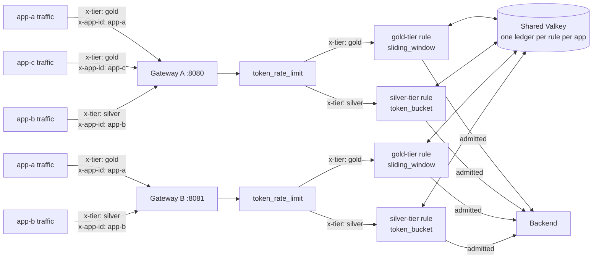

# Per-app token budgets with token_rate_limit, mixed algorithms per rule

> [!IMPORTANT]
> This is early exploratory work intended to validate the sliding-window
> ledger and bucket-key architecture and inform the design questions
> still open on [ai#658](https://github.com/praxis-proxy/ai/pull/658),
> the canonical Token Rate Limiting proposal. It is not the final
> upstream design — see "Current scope" and "Open design questions"
> below. Configuration and behavior are expected to change, possibly
> substantially, as the proposal is reviewed and implemented upstream.
>
> **The `token_rate_limit` code this demo exercises has not landed in
> `praxis-ai` (or any upstream repo) yet.** It only exists on a personal
> fork branch. "Build and run" below is not optional boilerplate — you
> cannot build this demo's gateway image without pointing at that
> branch, because `main` does not have this filter's sliding-window/
> token-bucket/Valkey support at all.
>
> **As of this writing, the mixed-algorithm commits described below are
> committed locally on that branch but not yet pushed to the fork.**
> `PRAXIS_AI_SRC` pointed at a local checkout of the branch will pick
> them up; cloning the fork remote fresh (as "Build and run" shows)
> will not, until the push happens. This note should be removed once
> the branch is pushed.

This demo runs **two independent Praxis AI gateway instances** sharing
one Valkey-backed `token_rate_limit` budget per application, evaluated
against **two rules, each independently choosing its own admission
algorithm** — the current scenario for per-app budgets: an app's
traffic can land on either gateway replica and still draw down the
same budget, and different apps can be on entirely different
algorithms in the same deployment. It validates, end-to-end and across
a real process boundary:

- **Per-rule algorithm choice**, per
  [ai#789](https://github.com/praxis-proxy/ai/issues/789)/[praxis#551](https://github.com/praxis-proxy/praxis/issues/551):
  a `gold-tier` rule (`x-tier: gold`) enforces an exact sliding-window
  budget; a `silver-tier` rule (`x-tier: silver`) enforces a
  continuously-refilling token-bucket budget, in the same filter
  instance. See "Current scope" for exactly what's implemented where.
- [ai#129](https://github.com/praxis-proxy/ai/issues/129)'s
  `bucket_key_header` proposal: within whichever rule matched, one
  independent token budget per unique value of a configured request
  header (`x-app-id` here).
- Reservation-based admission, reconciled against actual
  provider-reported usage, shared atomically across gateway replicas
  via Valkey — for **both** algorithms, not just one.

## What this demonstrates

- A platform operator configures an ordered list of `token_rate_limit`
  rules, each with its own optional `match` condition and its own
  admission algorithm (`sliding_window` or `token_bucket`); the first
  rule whose `match` is satisfied applies. Within a matched rule, a
  `bucket_key_header` (e.g. `x-app-id`) gives every unique header value
  its own independent budget, shared by every gateway instance pointed
  at the same Valkey namespace.
- **An app's budget is enforced consistently regardless of which
  gateway instance its traffic lands on, for either algorithm.** A
  request admitted on gateway A that exhausts app-a's (sliding-window)
  or app-b's (token-bucket) budget is visible immediately as an
  exhausted budget on gateway B — there is no per-replica budget
  multiplication, and this guarantee doesn't depend on which algorithm
  the matched rule picked.
- Each app's traffic draws down only its own budget: one app exhausting
  its budget and receiving `429`s has zero effect on any other app,
  even sharing the same Valkey namespace, even when they're on
  different rules/algorithms entirely.
- Requests missing the configured `bucket_key_header` fall back to one
  shared budget per rule.
- Praxis reserves an estimated token cost at admission and reconciles
  it against the provider's actual reported usage once the response
  completes — unused capacity is returned to the budget either way,
  but the two algorithms recover it differently: sliding_window returns
  it as the trailing window slides past the reservation; token_bucket
  returns it immediately on reconciliation and additionally refills
  continuously over time.
- Standard `429` responses carry token-denominated
  `X-RateLimit-*-Tokens` headers and a `Retry-After` value, computed
  correctly for either algorithm.

## Architecture



Unlike the
[distributed token rate limiting with Grid routing](../grid-distributed-token-rate-limit/README.md)
demo (which layers a shared quota under Grid's multi-cluster provider
routing), this demo is deliberately narrow: two gateway replicas, one
Valkey instance, no Grid, no multi-cluster routing. It isolates the
per-app bucket-key architecture and the sliding-window/Valkey backend
questions from the routing-layer questions the other demo explores.

## Recorded walkthrough

`recording/output/mixed-algorithms-token-rate-limit.mp4` (1920x1080,
h264/aac, ~79s) is a narrated recording of the mixed-algorithm scenario
below, driven through `dashboard/` against a live two-gateway + Valkey
stack. Requests are paced against the narration throughout the clip, and
each app's budget renders as a live gauge plus a rolling chart so the
`sliding_window` "flat until the window slides" recovery and the
`token_bucket` "continuous ramp" recovery are visually distinct, not just
narrated. See `recording/RECORDING.md` for what it proves, how it was
produced (including a lab-host Podman/SELinux workaround), and a
reconciliation-behavior asymmetry between the two algorithms that
recording this surfaced.

`dashboard/` is a browser-facing convenience used for recording; it wraps
the same HTTP contract as the curl walkthrough below and is not part of
the Praxis AI filter chain.

## Prerequisites

- Docker or Podman with Compose (`docker compose` / `podman compose`)
- Git and `curl`

## Build and run

Clone this repo and the source branch as siblings, then point
`PRAXIS_AI_SRC` at the source checkout and bring the stack up:

```bash
git clone https://github.com/praxis-proxy/experimental.git
git clone --branch jordigilh/token-rate-limit-per-app-budgets \
  https://github.com/jordigilh/praxis-ai.git praxis-ai-trl-demo

cd experimental/demos/token-rate-limit-per-app-budgets
export PRAXIS_AI_SRC=../../../praxis-ai-trl-demo
docker compose up --build -d   # or: podman compose up --build -d
```

This builds the gateway image from the source branch's own
`Containerfile` (a first build compiles the whole Rust workspace, so
expect it to take several minutes) and starts four containers:

| Service | Role |
| --- | --- |
| `valkey` | Shared ledger backend for both the sliding-window (`gold-tier`) and token-bucket (`silver-tier`) rules |
| `backend` | Minimal stub upstream, returns a fixed OpenAI-shaped response with `usage.total_tokens: 10` |
| `gateway-a` | Praxis AI gateway, `127.0.0.1:8080` |
| `gateway-b` | Praxis AI gateway, same image/config/Valkey namespace, `127.0.0.1:8081` |

Both gateways load the exact same `config.yaml` (two rules, one per
algorithm); the only thing that makes their budgets *shared* rather
than *independent* is pointing both at the same Valkey `namespace`.

## Validate the request flow

`gold-tier` (`sliding_window`) uses `capacity: 40` tokens,
`estimate_tokens: 40` per request — the *first* request from a given app
fully reserves its budget, and reconciliation refunds 30 of the 40
reserved (the stub backend always reports `total_tokens: 10`) but does
**not** retroactively free that capacity within the window (see "Open
design questions" below) — so a second request is denied until the
window itself slides. `silver-tier` (`token_bucket`) instead uses
`capacity: 10`, `estimate_tokens: 10` — deliberately equal to the stub's
real usage, refunding ~0 — because `token_bucket`'s reconciliation *does*
credit any estimate/actual gap straight back into the bucket; at
`gold-tier`'s larger numbers that refund alone would admit a second
request almost immediately, defeating the point (this asymmetry was found
empirically while producing `recording/RECORDING.md`, not by design). Both
`gold-tier`'s `window: 10s` and `silver-tier`'s `refill_rate: 2` tokens/sec
are similarly shortened from realistic production values purely so
recovery is watchable in seconds instead of the hour+ a production
deployment would take. Every request must carry `x-tier` (selects the
rule/algorithm) alongside `x-app-id` (selects the per-app budget within
that rule) — a request missing `x-tier` matches no rule and isn't
rate-limited by this filter instance at all (see `config.yaml`).

Send app-a's (`x-tier: gold`, sliding_window) first request to gateway
A, then its second to gateway B — the *other* process:

```bash
echo "== app-a (gold/sliding_window) on gateway A (expect 200) =="
curl -si http://127.0.0.1:8080/v1/chat/completions \
  -H "x-tier: gold" -H "x-app-id: app-a" -H 'Content-Type: application/json' \
  -d '{"model":"gpt-4","messages":[{"role":"user","content":"hi"}]}' \
  | grep -Ei '^(HTTP|x-ratelimit|retry-after)'

echo "== app-a on gateway B (expect 429 -- shared Valkey budget) =="
curl -si http://127.0.0.1:8081/v1/chat/completions \
  -H "x-tier: gold" -H "x-app-id: app-a" -H 'Content-Type: application/json' \
  -d '{"model":"gpt-4","messages":[{"role":"user","content":"hi"}]}' \
  | grep -Ei '^(HTTP|x-ratelimit|retry-after)'

echo "== app-c (gold/sliding_window) on gateway A (expect 200 -- unaffected by app-a) =="
curl -si http://127.0.0.1:8080/v1/chat/completions \
  -H "x-tier: gold" -H "x-app-id: app-c" -H 'Content-Type: application/json' \
  -d '{"model":"gpt-4","messages":[{"role":"user","content":"hi"}]}' \
  | grep -Ei '^(HTTP|x-ratelimit|retry-after)'

echo "== app-b (silver/token_bucket) on gateway A (expect 200 -- different rule entirely) =="
curl -si http://127.0.0.1:8080/v1/chat/completions \
  -H "x-tier: silver" -H "x-app-id: app-b" -H 'Content-Type: application/json' \
  -d '{"model":"gpt-4","messages":[{"role":"user","content":"hi"}]}' \
  | grep -Ei '^(HTTP|x-ratelimit|retry-after)'

echo "== app-b on gateway B (expect 429 -- shared Valkey holds for token_bucket too) =="
curl -si http://127.0.0.1:8081/v1/chat/completions \
  -H "x-tier: silver" -H "x-app-id: app-b" -H 'Content-Type: application/json' \
  -d '{"model":"gpt-4","messages":[{"role":"user","content":"hi"}]}' \
  | grep -Ei '^(HTTP|x-ratelimit|retry-after)'
```

Expect (verified against a live run of this exact scenario, driven
directly against the built gateway binaries against a real Valkey
instance while authoring this demo):

- app-a's request on gateway A: `200`.
- app-a's request on gateway B, immediately after: `429` with
  `X-RateLimit-Remaining-Tokens: 0`, `Retry-After: 10` — the *other*
  gateway process sees app-a's budget as already exhausted, because
  both consult the same Valkey ledger rather than keeping independent
  in-process state.
- app-c's request on gateway A: `200` — app-c's budget is untouched by
  app-a's exhaustion, even on the same rule/algorithm and Valkey
  namespace.
- app-b's request on gateway A: `200` — a completely different rule
  (`silver-tier`, `token_bucket`), matched purely on `x-tier`, with its
  own budget.
- app-b's request on gateway B, immediately after: `429` with
  `X-RateLimit-Remaining-Tokens: 0`, `Retry-After: 5` (varies run to
  run: token_bucket's retry-after is a function of the live refill
  math, not a fixed window boundary like sliding_window's) — proving
  the shared-Valkey, cross-instance guarantee holds for `token_bucket`
  too, not just `sliding_window`.

Wait for both algorithms to recover, then retry both app-a on gateway A
and app-b on gateway B — no restart, no manual reset, nothing but time
passing:

```bash
sleep 11
echo "== app-a on gateway A again (expect 200 -- sliding window recovered) =="
curl -si http://127.0.0.1:8080/v1/chat/completions \
  -H "x-tier: gold" -H "x-app-id: app-a" -H 'Content-Type: application/json' \
  -d '{"model":"gpt-4","messages":[{"role":"user","content":"hi"}]}' \
  | grep -Ei '^(HTTP|x-ratelimit|retry-after)'

echo "== app-b on gateway B again (expect 200 -- token bucket refilled) =="
curl -si http://127.0.0.1:8081/v1/chat/completions \
  -H "x-tier: silver" -H "x-app-id: app-b" -H 'Content-Type: application/json' \
  -d '{"model":"gpt-4","messages":[{"role":"user","content":"hi"}]}' \
  | grep -Ei '^(HTTP|x-ratelimit|retry-after)'
```

Expect `200` on both. What "recovered" means differs by algorithm:

- **app-a (sliding_window)**: the trailing window has moved forward far
  enough that app-a's earlier reservation is no longer counted against
  its budget. There is no fixed reset boundary (like a calendar month
  rolling over); the budget recovers continuously and independently as
  its own past usage ages out.
- **app-b (token_bucket)**: the bucket has been continuously refilling
  at `refill_rate: 2` tokens/sec since app-b's last request (reconciliation
  itself credits back ~0 here, by design — see "Validate the request flow"
  above). It becomes admissible again in 5s from exhaustion (`capacity: 10`
  / `refill_rate: 2`), well before the full 11s wait, since refill is
  continuous rather than gated on a fixed window boundary — the `sleep 11`
  above is sized for gold-tier's slower path, not because silver-tier
  needs it too.

This was verified against a live run of the built gateway binaries
(`praxis-ai` from the source branch) directly against a real Valkey
instance while authoring this demo -- two gateway processes on
different ports, both pointed at the same Valkey, driven with the
`curl` commands above, not just checked against source. It was **not**
separately re-verified through the `docker compose` stack itself in
this environment (a local container-runtime issue blocked bringing the
compose stack up while authoring this update); the compose stack uses
the identical `config.yaml` and gateway image, so the same behavior is
expected, but that specific path is unconfirmed as of this writing.

## Current scope

This needs to be read alongside
[ai#658](https://github.com/praxis-proxy/ai/pull/658)'s own review
thread, not as a substitute for it:

- **Per-rule algorithm choice is now implemented on the source
  branch**: `rules:` is an ordered list, each with its own optional
  `match`, its own algorithm (`sliding_window` or `token_bucket`), and
  its own budget -- exactly the capability the "Open design questions"
  section below used to flag as confirmed-but-not-built. **This is
  still only on the personal fork branch this demo builds from, not
  merged into `praxis-ai` upstream.**
- **sliding_window**: an exact trailing-window admission ledger,
  matching ai#658's current design doc ("windows are sliding: a
  `window: 1h` budget tracks usage in the most recent 60 minutes from
  the current instant"). [praxis#551](https://github.com/praxis-proxy/praxis/issues/551)
  (a sliding-window primitive in the core `praxis` proxy) is still
  open; this filter carries its own sliding-window ledger rather than
  depending on it, so it doesn't block this MVP.
- **token_bucket**: continuous refill up to `capacity` at `refill_rate`
  tokens/sec, reusing Praxis's own lock-free
  `traffic_management::token_bucket` refill formula, extended with the
  reserve/reconcile split this filter needs. This demo's *first*
  version implemented token bucket unconditionally (before
  sliding_window existed in the source branch); see "Alternative
  implementations considered" below for that history. Per-rule choice
  means both now coexist rather than one superseding the other.
- **The per-key bucket architecture** (resolve a key from a
  configurable header, look it up in a keyed map, fall back to a
  shared budget when the header's absent, evict idle keys) is meant to
  be reusable regardless of which rate-limiting algorithm ai#658
  ultimately specifies.
- **State is pluggable**: in-process (default, one gateway, no shared
  state) or Valkey (`backend: {kind: valkey}`, this demo). Both share
  the same reservation/reconciliation semantics; only where the ledger
  lives differs.
- Composite/multi-dimension keys, per-model keys, CEL-expression keys,
  configurable token estimation, and token-type-aware accounting are
  all out of scope here — see the module doc on the source branch for
  the full list.

## Alternative implementations considered

- **Envoy-style external rate-limit gRPC service.** The canonical
  Envoy pattern runs quota state behind a separate gRPC sidecar/service
  that every proxy instance calls out to. Rejected here in favor of an
  in-filter backend trait (`reserve`/`reconcile` calls made directly
  from the filter, Valkey accessed via a plain client rather than a
  bespoke RPC surface): it avoids standing up and operating an
  additional service just for this MVP, at the cost of coupling the
  quota logic to Praxis AI's own filter lifecycle rather than making it
  reusable outside Praxis. Worth revisiting if quota enforcement needs
  to be shared with non-Praxis callers.
- **Token bucket only, no algorithm choice (this demo's first
  version).** The very first version of this demo implemented a
  token-bucket algorithm (`rate`/`burst` refill) unconditionally, not
  sliding-window, because the sliding-window ledger didn't exist yet in
  the source branch and praxis#551 was (and still is) unresolved in the
  core proxy. That version was superseded once the source branch grew
  its own exact sliding-window ledger (adapted from
  [nerdalert's spike branch](https://github.com/nerdalert/ai/tree/poc/distributed-token-rate-limit-demo)),
  closing the gap with ai#658's design doc without waiting on
  praxis#551 -- and *that* version, in turn, is what this demo now
  extends with per-rule algorithm choice rather than picking one
  algorithm to keep and one to drop.
- **[Distributed token rate limiting with Grid routing](../grid-distributed-token-rate-limit/README.md)
  demo's approach.** That demo validates the same Valkey-backed
  sliding-window ledger concept, but keyed by authenticated
  principal+model and layered under Grid's multi-cluster provider
  routing on a full Kind/Helm/Grid stack. This demo deliberately keeps
  the same core idea (shared Valkey ledger, reservation/reconciliation)
  but strips out Grid, multi-cluster routing, and authentication
  entirely, keyed by a plain request header instead, so the per-app
  bucket-key question can be evaluated in isolation on a two-container
  `docker compose` stack instead of a multi-cluster deployment.
- **Local-only in-memory state for the "shared across replicas"
  scenario.** Rejected as insufficient for what this demo specifically
  needs to show: in-process state is already covered by this filter's
  default (no `backend:` block) and is fine for a single gateway
  instance, but says nothing about the multi-replica case, which is
  the actual point of this demo. Valkey is the minimum needed to prove
  budgets survive a real process boundary.

## Open design questions

These are unresolved as of this writing. Expect this demo's behavior,
config shape, or scope to change once they're settled — treat it as a
snapshot of one point in an ongoing design discussion, not a preview of
the final feature.

- **Per-rule algorithm choice is implemented here, but only on a
  personal fork branch, and upstream hasn't weighed in on the shape.**
  Neither the epic ([ai#121](https://github.com/praxis-proxy/ai/issues/121))
  nor the proposal ([ai#658](https://github.com/praxis-proxy/ai/pull/658))
  originally said whether `token_rate_limit` should support only sliding
  window, or let an operator pick an algorithm per rule; a comment on
  [praxis#551](https://github.com/praxis-proxy/praxis/issues/551)
  captured mixed per-app algorithm choice as a real requirement (one app
  on sliding window, another on token bucket, same deployment), and this
  demo/source branch now implement exactly that (`rules:` with a
  `match` + `algorithm` per rule -- see "Current scope"). What's still
  open: whether `rules:`/`match: {headers: ...}` is the config shape
  upstream actually wants (vs. e.g. a different matcher syntax, CEL
  expressions per praxis#189/#232, or a different name), and whether a
  third algorithm (fixed window) should exist alongside these two.
  Don't read this demo's specific config shape as upstream-approved;
  it's one concrete proposal for maintainer review, not a decision.
- **Window duration and refill rate are config knobs, not yet
  customer-tunable requirements anywhere in the proposal.** This demo
  uses `window: 10s` and `refill_rate: 2` purely to make each
  algorithm's recovery visible in a short recording; nothing in ai#658
  pins either value, and calendar-aligned windows (e.g. reset at UTC
  midnight rather than "most recent N seconds") are a distinct semantic
  that neither algorithm here provides and hasn't been requested yet.
- **The two algorithms reconcile differently, and that asymmetry isn't
  documented or decided anywhere upstream.** Found empirically while
  producing `recording/RECORDING.md`, not by reading a spec:
  `token_bucket`'s reconciliation credits any estimate/actual gap
  straight back into the bucket (a continuously-refilling resource), so
  an over-estimated request effectively unlocks extra capacity the
  moment it settles; `sliding_window`'s reconciliation does not
  retroactively shrink what's already counted against the trailing
  window (a historical-usage ledger), so an over-estimate stays "spent"
  for the rest of the window regardless of how the request actually
  settled. Neither behavior is wrong on its own, but which one an
  operator should *expect* — and whether both should behave the same
  way — is an open question, not a documented decision.
- **The Valkey backend is a spike, not yet aligned with
  [grid#83](https://github.com/praxis-proxy/grid/issues/83)**, the
  authoritative spec for Valkey-backed distributed quota state (published
  after this demo's backend was first written). Concretely, against
  grid#83's requirements:
  - *Met:* atomic reserve/reconcile via Lua (`EVAL`), idempotent
    reconciliation (a reservation can only be settled once), reservation
    TTL + cleanup for abandoned requests, and **fail-closed on backend
    error** — a Valkey timeout or error returns `503`, not silent
    admission (see `on_request` in the source branch's `mod.rs`).
  - *Not met, by deliberate demo simplification:* this compose stack's
    Valkey runs with **no authentication** and **`--save ""`
    (persistence disabled)** — see `docker-compose.yml`. grid#83 requires
    explicit auth, private network access, and documented durable
    storage/backup behavior; this demo proves none of that, only the
    reservation/reconciliation logic on top of an ephemeral, unauthenticated
    instance.
  - *Not exercised by this demo's walkthrough or test suite:* grid#83's
    validation checklist also asks for proof that usage survives a
    consumer restart, that concurrent reservations can't oversubscribe
    capacity under load, and that a Valkey outage-then-recovery cycle
    fails closed and then resumes without resetting existing usage. None
    of those are demonstrated here — only the steady-state admit/deny/
    recover-on-window-slide path is.
  - *Config gap:* the backend/Lua layer already supports multiple atomic
    budgets per key (`Vec<Budget>`), but `token_rate_limit`'s own config
    schema only exposes a single `window`/`capacity` pair per rule today —
    multi-window enforcement exists underneath but isn't wired up to
    configuration yet.

## Related work

- [Canonical token-rate-limit proposal](https://github.com/praxis-proxy/ai/pull/658)
- [ai#129: Per-header rate limit bucket keys](https://github.com/praxis-proxy/ai/issues/129)
- [ai#121: Epic — Token Rate Limiting](https://github.com/praxis-proxy/ai/issues/121)
- [praxis#551: Sliding window rate limiting](https://github.com/praxis-proxy/praxis/issues/551)
- [grid#83: Support Valkey-backed distributed quota state](https://github.com/praxis-proxy/grid/issues/83)
- [Source branch](https://github.com/jordigilh/praxis-ai/tree/jordigilh/token-rate-limit-per-app-budgets)
- [Distributed token rate limiting with Grid routing](../grid-distributed-token-rate-limit/README.md):
  a complementary demo exploring distributed counters, authentication,
  and multi-gateway quota sharing under Grid routing
