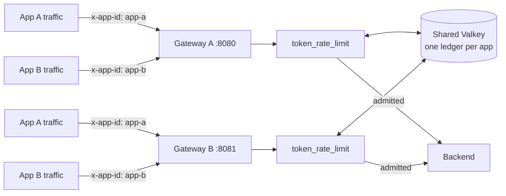

# Per-app token budgets with token_rate_limit

> [!IMPORTANT]
> This is early exploratory work intended to validate the sliding-window
> ledger and bucket-key architecture and inform the design questions
> still open on [ai#658](https://github.com/praxis-proxy/ai/pull/658),
> the canonical Token Rate Limiting proposal. It is not the final
> upstream design — see "Current scope" below. Configuration and
> behavior are expected to change as the proposal is reviewed and
> implemented upstream.

This demo runs **two independent Praxis AI gateway instances** sharing
one Valkey-backed `token_rate_limit` budget per application — the
"final scenario" for per-app budgets: an app's traffic can land on
either gateway replica and still draw down the same budget. It
validates, end-to-end and across a real process boundary:

- [ai#129](https://github.com/praxis-proxy/ai/issues/129)'s
  `bucket_key_header` proposal: one independent token budget per
  unique value of a configured request header.
- An exact sliding-window admission ledger, matching the algorithm in
  [ai#658](https://github.com/praxis-proxy/ai/pull/658)'s current
  design doc (not the token-bucket model this demo used previously —
  see "Current scope").
- Reservation-based admission, reconciled against actual
  provider-reported usage, shared atomically across gateway replicas
  via Valkey.

## What this demonstrates

- A platform operator configures one `token_rate_limit` rule with a
  `bucket_key_header` (e.g. `x-app-id`) and a `backend: {kind: valkey}`;
  every unique header value gets its own independent sliding-window
  budget, shared by every gateway instance pointed at the same Valkey
  namespace.
- **An app's budget is enforced consistently regardless of which
  gateway instance its traffic lands on.** A request admitted on
  gateway A that exhausts app-a's budget is visible immediately as an
  exhausted budget on gateway B — there is no per-replica budget
  multiplication.
- Each app's traffic draws down only its own budget: one app exhausting
  its budget and receiving `429`s has zero effect on any other app,
  even sharing the same Valkey namespace.
- Requests missing the configured header fall back to one shared
  budget.
- Praxis reserves an estimated token cost at admission and reconciles
  it against the provider's actual reported usage once the response
  completes — unused capacity is returned to the window.
- Standard `429` responses carry token-denominated
  `X-RateLimit-*-Tokens` headers and a `Retry-After` value.

## Architecture



Unlike the
[distributed token rate limiting with Grid routing](../grid-distributed-token-rate-limit/README.md)
demo (which layers a shared quota under Grid's multi-cluster provider
routing), this demo is deliberately narrow: two gateway replicas, one
Valkey instance, no Grid, no multi-cluster routing. It isolates the
per-app bucket-key architecture and the sliding-window/Valkey backend
questions from the routing-layer questions the other demo explores.

## Recorded walkthrough

A narrated recording of the scenario below (`recording/output/final.mp4`),
driven by a live browser against a real running instance of this stack, not
staged -- see `recording/RECORDING.md` for what it proves and how to
reproduce it. `dashboard/` is a browser-facing convenience used only for
that recording; it wraps the same HTTP contract as the curl walkthrough
below and is not part of the Praxis AI filter chain.

## Prerequisites

- Docker or Podman with Compose (`docker compose` / `podman compose`)
- Git and `curl`

## Build and run

Clone this repo and the source branch as siblings, then point
`PRAXIS_AI_SRC` at the source checkout and bring the stack up:

```bash
git clone https://github.com/praxis-proxy/experimental.git
git clone --branch jordigilh/token-rate-limit-per-app-budgets \
  https://github.com/jordigilh/praxis-ai.git praxis-ai-trl-demo

cd experimental/demos/token-rate-limit-per-app-budgets
export PRAXIS_AI_SRC=../../../praxis-ai-trl-demo
docker compose up --build -d   # or: podman compose up --build -d
```

This builds the gateway image from the source branch's own
`Containerfile` (a first build compiles the whole Rust workspace, so
expect it to take several minutes) and starts four containers:

| Service | Role |
| --- | --- |
| `valkey` | Shared sliding-window ledger backend |
| `backend` | Minimal stub upstream, returns a fixed OpenAI-shaped response with `usage.total_tokens: 10` |
| `gateway-a` | Praxis AI gateway, `127.0.0.1:8080` |
| `gateway-b` | Praxis AI gateway, same image/config/Valkey namespace, `127.0.0.1:8081` |

Both gateways load the exact same `config.yaml`; the only thing that
makes their budgets *shared* rather than *independent* is pointing both
at the same Valkey `namespace`.

## Validate the request flow

Each app's budget is `capacity: 40` tokens, `estimate_tokens: 40` per
request, `window: 10s` — so the *first* request from a given app fully
reserves its budget, and reconciliation only partially refunds it (the
stub backend always reports `total_tokens: 10`, refunding 30 of the 40
reserved — not enough for another full-estimate admission until that
reservation ages out of the 10s window). The window is shortened to
10s purely so the recovery step below is watchable in seconds instead
of the hour a production `window: 1h` would take; the mechanism is
identical either way.

Send app-a's first request to gateway A, then its second to gateway
B — the *other* process:

```bash
echo "== app-a on gateway A (expect 200) =="
curl -si http://127.0.0.1:8080/v1/chat/completions \
  -H "x-app-id: app-a" -H 'Content-Type: application/json' \
  -d '{"model":"gpt-4","messages":[{"role":"user","content":"hi"}]}' \
  | grep -Ei '^(HTTP|x-ratelimit|retry-after)'

echo "== app-a on gateway B (expect 429 -- shared Valkey budget) =="
curl -si http://127.0.0.1:8081/v1/chat/completions \
  -H "x-app-id: app-a" -H 'Content-Type: application/json' \
  -d '{"model":"gpt-4","messages":[{"role":"user","content":"hi"}]}' \
  | grep -Ei '^(HTTP|x-ratelimit|retry-after)'

echo "== app-b on gateway B (expect 200 -- unaffected by app-a) =="
curl -si http://127.0.0.1:8081/v1/chat/completions \
  -H "x-app-id: app-b" -H 'Content-Type: application/json' \
  -d '{"model":"gpt-4","messages":[{"role":"user","content":"hi"}]}' \
  | grep -Ei '^(HTTP|x-ratelimit|retry-after)'
```

Expect:

- app-a's request on gateway A: `200`.
- app-a's request on gateway B, immediately after: `429`, with
  `X-RateLimit-Remaining-Tokens: 0` — the *other* gateway process sees
  app-a's budget as already exhausted, because both consult the same
  Valkey ledger rather than keeping independent in-process state.
- app-b's request on gateway B: `200` — app-b's budget is untouched by
  app-a's exhaustion, even though both apps' budgets live in the same
  Valkey namespace.

Wait for the 10s window to age out app-a's original reservation, then
retry on gateway A — no restart, no manual reset, nothing but time
passing:

```bash
sleep 11
echo "== app-a on gateway A again (expect 200 -- window recovered) =="
curl -si http://127.0.0.1:8080/v1/chat/completions \
  -H "x-app-id: app-a" -H 'Content-Type: application/json' \
  -d '{"model":"gpt-4","messages":[{"role":"user","content":"hi"}]}' \
  | grep -Ei '^(HTTP|x-ratelimit|retry-after)'
```

Expect `200` — the sliding window has moved forward far enough that
app-a's earlier reservation is no longer counted against its budget.
This is what "sliding" means in practice: there is no fixed reset
boundary (like a calendar month rolling over); each app's budget
recovers continuously and independently as its own past usage ages
out.

This was verified against a live run of this exact compose stack while
authoring this demo, not just against source.

## Current scope

This needs to be read alongside
[ai#658](https://github.com/praxis-proxy/ai/pull/658)'s own review
thread, not as a substitute for it:

- **The sliding-window algorithm is now implemented**, matching
  ai#658's current design doc ("windows are sliding: a `window: 1h`
  budget tracks usage in the most recent 60 minutes from the current
  instant"). This demo previously implemented a token bucket instead —
  see "Alternative implementations considered" below for why that
  changed. [praxis#551](https://github.com/praxis-proxy/praxis/issues/551)
  (a sliding-window primitive in the core `praxis` proxy) is still
  open; this filter carries its own sliding-window ledger rather than
  depending on it, so it doesn't block this MVP.
- **The per-key bucket architecture** (resolve a key from a
  configurable header, look it up in a keyed map, fall back to a
  shared budget when the header's absent, evict idle keys) is meant to
  be reusable regardless of which rate-limiting algorithm ai#658
  ultimately specifies.
- **State is pluggable**: in-process (default, one gateway, no shared
  state) or Valkey (`backend: {kind: valkey}`, this demo). Both share
  the same reservation/reconciliation semantics; only where the ledger
  lives differs.
- Composite/multi-dimension keys, per-model keys, CEL-expression keys,
  configurable token estimation, and token-type-aware accounting are
  all out of scope here — see the module doc on the source branch for
  the full list.

## Alternative implementations considered

- **Envoy-style external rate-limit gRPC service.** The canonical
  Envoy pattern runs quota state behind a separate gRPC sidecar/service
  that every proxy instance calls out to. Rejected here in favor of an
  in-filter backend trait (`reserve`/`reconcile` calls made directly
  from the filter, Valkey accessed via a plain client rather than a
  bespoke RPC surface): it avoids standing up and operating an
  additional service just for this MVP, at the cost of coupling the
  quota logic to Praxis AI's own filter lifecycle rather than making it
  reusable outside Praxis. Worth revisiting if quota enforcement needs
  to be shared with non-Praxis callers.
- **Token bucket (this demo's own prior implementation).** The first
  version of this demo implemented a token-bucket algorithm
  (`rate`/`burst` refill), not sliding-window, because the
  sliding-window ledger didn't exist yet in the source branch and
  praxis#551 was (and still is) unresolved in the core proxy. Superseded
  once the source branch grew its own exact sliding-window ledger
  (adapted from
  [nerdalert's spike branch](https://github.com/nerdalert/ai/tree/poc/distributed-token-rate-limit-demo)),
  closing the gap with ai#658's design doc without waiting on
  praxis#551.
- **[Distributed token rate limiting with Grid routing](../grid-distributed-token-rate-limit/README.md)
  demo's approach.** That demo validates the same Valkey-backed
  sliding-window ledger concept, but keyed by authenticated
  principal+model and layered under Grid's multi-cluster provider
  routing on a full Kind/Helm/Grid stack. This demo deliberately keeps
  the same core idea (shared Valkey ledger, reservation/reconciliation)
  but strips out Grid, multi-cluster routing, and authentication
  entirely, keyed by a plain request header instead, so the per-app
  bucket-key question can be evaluated in isolation on a two-container
  `docker compose` stack instead of a multi-cluster deployment.
- **Local-only in-memory state for the "shared across replicas"
  scenario.** Rejected as insufficient for what this demo specifically
  needs to show: in-process state is already covered by this filter's
  default (no `backend:` block) and is fine for a single gateway
  instance, but says nothing about the multi-replica case, which is
  the actual point of this demo. Valkey is the minimum needed to prove
  budgets survive a real process boundary.

## Open design questions

- **Algorithm choice is not yet specified by ai#658/ai#121.** This demo
  and the source branch implement a sliding window unconditionally.
  Neither the epic ([ai#121](https://github.com/praxis-proxy/ai/issues/121))
  nor the proposal ([ai#658](https://github.com/praxis-proxy/ai/pull/658))
  says whether `token_rate_limit` should support only sliding window, or
  let an operator pick an algorithm (sliding window, token bucket, fixed
  window) per rule. [praxis#551](https://github.com/praxis-proxy/praxis/issues/551) —
  a separate, core-proxy rate-limit issue — already proposes both a
  configurable window duration and independent per-rule algorithm
  choice; whether that same principle should extend to `token_rate_limit`
  is an open question worth raising against praxis#551 or ai#658 for
  maintainer input, not something this demo or its source branch decide
  unilaterally.
- **Window duration is a config knob, not yet a customer-tunable
  requirement anywhere in the proposal.** This demo uses `window: 10s`
  purely to make the recovery visible in a short recording; nothing in
  ai#658 pins the value, and calendar-aligned windows (e.g. reset at UTC
  midnight rather than "most recent N seconds") are a distinct semantic
  that sliding window does not provide and hasn't been requested yet.

## Related work

- [Canonical token-rate-limit proposal](https://github.com/praxis-proxy/ai/pull/658)
- [ai#129: Per-header rate limit bucket keys](https://github.com/praxis-proxy/ai/issues/129)
- [ai#121: Epic — Token Rate Limiting](https://github.com/praxis-proxy/ai/issues/121)
- [praxis#551: Sliding window rate limiting](https://github.com/praxis-proxy/praxis/issues/551)
- [Source branch](https://github.com/jordigilh/praxis-ai/tree/jordigilh/token-rate-limit-per-app-budgets)
- [Distributed token rate limiting with Grid routing](../grid-distributed-token-rate-limit/README.md):
  a complementary demo exploring distributed counters, authentication,
  and multi-gateway quota sharing under Grid routing
