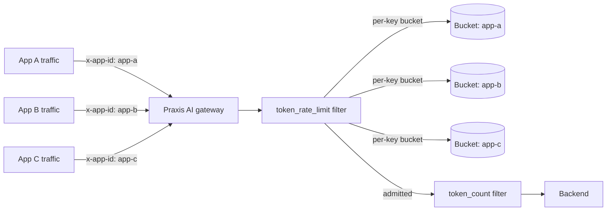

# Per-app token budgets with token_rate_limit

> [!IMPORTANT]
> This is early exploratory work intended to validate the bucket-key
> architecture and inform the design questions still open on
> [ai#658](https://github.com/praxis-proxy/ai/pull/658), the canonical
> Token Rate Limiting proposal. It is not the final upstream design, and
> the algorithm implemented here is a known, deliberate divergence from
> that proposal's current design doc — see "Current scope" below.
> Configuration and behavior are expected to change as the proposal is
> reviewed and implemented upstream.

This demo exercises a single Praxis AI gateway configured with a
`token_rate_limit` filter that hands out independent token budgets to
multiple applications sharing one gateway, keyed by a configurable
request header. It validates
[ai#129](https://github.com/praxis-proxy/ai/issues/129)'s
`bucket_key_header` proposal end-to-end: reservation-based admission,
`429` responses with token-denominated rate limit headers, and
reconciliation against actual provider-reported usage.

## What this demonstrates

- A platform operator configures one `token_rate_limit` rule with a
  `bucket_key_header` (e.g. `x-app-id`); every unique header value gets
  its own independent token bucket.
- Each app's traffic draws down only its own bucket — one app exhausting
  its budget and receiving `429`s has zero effect on any other app
  sharing the same gateway.
- Requests missing the configured header fall back to one shared bucket.
- Praxis reserves an estimated token cost at admission and reconciles it
  against the provider's actual reported usage once the response
  completes — unused capacity is returned to the bucket.
- Standard `429` responses carry token-denominated
  `X-RateLimit-*-Tokens` headers and a `Retry-After` value.

## Architecture



Unlike the
[distributed token rate limiting with Grid routing](../grid-distributed-token-rate-limit/README.md)
demo, this is a single-process, in-memory scenario: one gateway, no
shared backend (Valkey or otherwise), no distributed counters. It
validates the per-key bucket *architecture* in isolation from the
distributed-state and multi-gateway questions the other demo explores.

## Prerequisites

- Rust toolchain (see the source branch's `rust-toolchain.toml`)
- Git and `curl`

## Build and run

Clone this repo and the source branch as siblings, then run the demo
fixture config against the source branch's proxy binary:

```bash
git clone https://github.com/praxis-proxy/experimental.git
git clone --branch jordigilh/token-rate-limit-per-app-budgets \
  https://github.com/jordigilh/ai.git praxis-ai-trl-demo
cd praxis-ai-trl-demo
cargo run -p praxis-ai-proxy -- \
  -c ../experimental/demos/token-rate-limit-per-app-budgets/config.yaml
```

This starts the gateway on `127.0.0.1:8080`, proxying admitted requests
to a backend on `127.0.0.1:3000`. Rate-limiting behavior is visible even
without a real backend listening there — admission and rejection both
happen before the upstream request is made; only a fully admitted
request's response depends on a live backend.

## Validate the request flow

Send traffic tagged with different app identities. Each app's first
request is admitted; its 40-token budget (per the demo fixture config)
is then exhausted, so a second request from that same app — and only
that app — gets rejected:

```bash
for app in app-a app-b app-c; do
  echo "== $app: first request (expect 200) =="
  curl -si http://127.0.0.1:8080/v1/chat/completions \
    -H "x-app-id: $app" -H 'Content-Type: application/json' \
    -d '{"model":"gpt-4","messages":[{"role":"user","content":"hi"}]}' \
    | grep -Ei '^(HTTP|x-ratelimit|retry-after)'

  echo "== $app: second request (expect 429, budget exhausted) =="
  curl -si http://127.0.0.1:8080/v1/chat/completions \
    -H "x-app-id: $app" -H 'Content-Type: application/json' \
    -d '{"model":"gpt-4","messages":[{"role":"user","content":"hi"}]}' \
    | grep -Ei '^(HTTP|x-ratelimit|retry-after)'
done
```

Expect `app-a`'s second request to return `429` while `app-b` and
`app-c` remain fully unaffected — each has its own independent
40-token bucket. Requests without an `x-app-id` header share one
separate fallback bucket.

## Current scope

This needs to be read alongside
[ai#658](https://github.com/praxis-proxy/ai/pull/658)'s own review
thread, not as a substitute for it:

- **The per-key bucket architecture** (resolve a key from a
  configurable header, look it up in a keyed map, fall back to a shared
  bucket when the header's absent, evict idle keys) is meant to be
  reusable regardless of which rate-limiting algorithm `ai#658`
  ultimately specifies.
- **The algorithm actually implemented here is a token bucket**
  (`rate`/`burst`/`estimate_tokens` config), not the sliding-window
  model `ai#658`'s current design doc specifies. This is a known,
  deliberate divergence, not a scoped-down version of that design:
  - The sliding-window primitive doesn't exist yet —
    [praxis#551](https://github.com/praxis-proxy/praxis/issues/551) is
    still open in the core `praxis` repo.
  - The sliding-window design itself isn't settled — it currently only
    appears on `ai#658`'s own PR branch, which still has open review
    threads.
- Composite/multi-dimension keys, per-model keys, CEL-expression keys,
  configurable token estimation, and token-type-aware accounting are
  all out of scope here — see the module doc on the source branch for
  the full list.

## Related work

- [Canonical token-rate-limit proposal](https://github.com/praxis-proxy/ai/pull/658)
- [ai#129: Per-header rate limit bucket keys](https://github.com/praxis-proxy/ai/issues/129)
- [ai#121: Epic — Token Rate Limiting](https://github.com/praxis-proxy/ai/issues/121)
- [praxis#551: Sliding window rate limiting](https://github.com/praxis-proxy/praxis/issues/551)
- [Source branch](https://github.com/jordigilh/ai/tree/jordigilh/token-rate-limit-per-app-budgets)
- [Distributed token rate limiting with Grid routing](../grid-distributed-token-rate-limit/README.md):
  a complementary demo exploring distributed counters and multi-gateway
  quota sharing
