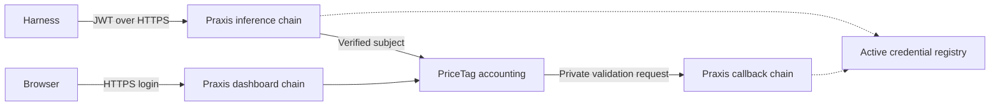

# Manual JWT authentication for standalone gateways

The `manual_jwt` filter supports administrator-issued RS256 credentials without
an automatic expiry, with explicit per-user revocation and rotation. It also
serves a private MaaS-compatible login-validation callback, allowing an unchanged
PriceTag metering service to authenticate its dashboard users.

This experimental design is opt-in. It does not change the existing policy JWT
resolver's expiry requirements. It needs no extra authentication service and
never loads a signing key into the gateway.

## Trust and listener roles

Configure the same issuer, audience, public key and credential registry in three
unconditional filter chains:

| Mode | Behavior |
| --- | --- |
| `inference` | Verify one Bearer JWT and active registry entry; replace `X-Tenant-Username` with its exact subject and remove caller credentials and identity headers |
| `callback` | On private `POST /validate`, accept `{"key":"JWT"}` and return `{"valid":true,"username":"subject","groups":[]}` after the same verification |
| `dashboard` | Strip untrusted identity headers and Authorization; require an allowed HTTPS Origin for unsafe methods; let metering authenticate its session cookie |



The callback should bind only a private interface/container network. Do not
publish that port or route `/validate` from the public listener. Set metering's
`MAAS_VALIDATE_URL` to the private callback. Keep metering and its PostgreSQL
database private, with only explicitly allowed dashboard routes exposed.
Authentication mode must not be skipped through filter conditions. Route public
inference to a dedicated unconditional authentication chain before accounting.

A filter instance uses:

```yaml
filter: manual_jwt
mode: inference
issuer: https://secure-single-server.local
audience: praxis-gateway
public_key_file: /etc/praxis/jwt-public.pem
registry_file: /etc/praxis/users.json
```

Use `mode: callback` on its private listener. For the dashboard chain, use
`mode: dashboard` and `allowed_origins: ["https://gateway.example:8443"]`.
Include HTTPS localhost explicitly if the administrator uses loopback login.
The public hostname must not be inferred from an untrusted forwarded header.
See [the listener example](../examples/configs/manual-jwt.yaml).

## Credentials and spending identity

The verifier accepts only RS256 signatures with the configured issuer and
audience. `sub`, `iat` and a nonempty `jti` are required; future `iat` is rejected.
`exp` is optional, but enforced when present, as is `nbf`. Clocks must agree.
This follows the optional registered-claim model in
[RFC 7519 section 4.1](https://datatracker.ietf.org/doc/html/rfc7519#section-4.1),
with additional local requirements for manually managed credentials.

The registry is versioned JSON, limited to 1 MiB:

```json
{
  "version": 1,
  "users": {
    "alice": {
      "digest": "SHA256_HEX_OF_THE_COMPLETE_SIGNED_JWT",
      "active": true
    }
  }
}
```

Replace the placeholder with 64 lowercase hexadecimal characters. Store no
private key or raw caller token in this file. One active digest per exact subject
makes rotation unambiguous: generate a new `jti`, sign with the same subject,
and atomically replace its digest. Revoke by setting `active` to false.

Every authentication reads the live registry; there is no positive-admission
cache. Missing, malformed or unreadable registry state fails closed with 503.
Invalid signatures/claims, unknown subjects and revoked or replaced credentials
return 401. In-flight inference may finish. Atomic updates retain the existing
identity, so metering usage and allowances are not reset.

The administrator owns the registry and parent directory. Give the container
read-only access to the **directory**, not a single-file bind mount, so atomic
replacement remains visible. Serialize writers and preserve permissions.
Host-to-VM shared filesystems may have visibility delays; server-local storage
is the intended deployment. Public-key replacement requires gateway reload or
restart; it invalidates the previous issuer's tokens.

The companion secure-single-server deployment supplies SSH-admin scripts for
provisioning, issuing, rotating and revoking credentials. They write caller
tokens to new mode-0600 files, never logs or command-line arguments.

## Browser sessions and limits

Metering owns its existing seven-day browser sessions. This filter does not
mint, decode or extend their cookies. JWT revocation stops new logins but cannot
invalidate an existing cookie for one user: metering has no per-token session
identifier. Rotating metering's session secret logs out all dashboard users.
Do not describe token revocation as immediate browser logout.

Dashboard mode provides header sanitization and Origin checks, not a new role
system. Exact user/admin roles remain metering's responsibility. Do not expose
state-changing GET routes such as impersonation in the public route allowlist.

USD budgets remain metering's responsibility. The companion deployment retains
its upstream 10-billion-token monthly safety net and removes the separate Praxis
`token_rate_limit` filter. Authentication failures are distinct from spending
or request-rate denials.

## Validation and image delivery

Run `cargo test -p praxis-experimental-filters manual_jwt` for claim, registry,
listener-mode, callback and identity-sanitization tests. The companion deployment's
`tests/pricetag/local.py` exercises the built image with real PostgreSQL,
unmodified metering, HTTPS login, native inference, rotation, revocation,
spending and outage checks.

Build for local qualification with:

```console
podman build --build-arg FEATURES=otel -t localhost/praxis-experimental:manual-jwt \
  -f Containerfile .
```

The repository's publication workflow targets GHCR. A downstream Quay build must
consume the merged revision before that image can be used; verify its source
revision and pin its digest. Until then, the manually built image is the test
artifact. Do not substitute an older published image lacking this filter.
